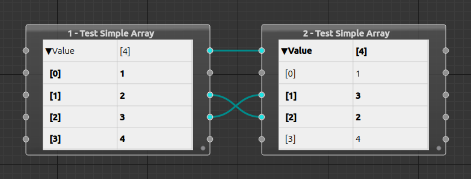

# BabelWires

BabelWires is an application for data format conversion.
The defining use-case is converting between music sequence formats, via the [BabelWires-Music](https://github.com/Malcohol/BabelWires-Music) plugin.
Here's a screenshot:


Here's a screenshot of the MapEditor defining a map between two types:


BabelWires is intended to be more flexible and expressive than command-line conversion utilities while having a lower barrier to entry than programming languages.

## Compound Data Flow

BabelWires uses a variant of the [dataflow paradigm](https://en.wikipedia.org/wiki/Dataflow_programming) I'm calling _compound data flow_.

As in conventional data flow systems, there are nodes with ports that can be wired together: In BabelWires, data enters the system at nodes corresponding to input files, passes through data processing nodes and reaches nodes corresponding to output files.

Less conventionally, the nodes and connections in BabelWires have a structure defined by the types of a type system.
That structure can correspond to _compound data types_ such as arrays and records.
In the simple synthetic example below, the nodes contain arrays of integers.
The UI presents such nodes as expandable, hierarchical property panels.
In the example, the top connection assigns the whole array value on the left to the array on the right.
The other two connections assign the int values themselves, and have the effect of exchanging the positions of the second and third array elements.



Data structures are implemented as shared, copy-on-write hierarchies.
This means that compound data can be moved around and modified without significant overhead.

## Status

[](https://github.com/Malcohol/BabelWires/actions/workflows/ci.yml)

BabelWires is intended to be cross platform and is officially supported on GNU/Linux, Windows and Mac OS. Automation compiles and runs unit tests but, as yet, there is no automated UI testing. 
Since GNU/Linux is my primary development platform, UI issues may be present on the other platforms.

BabelWires is under active development, but please do not expect development to be rapid.
My focus is on fundamentals.

## Downloading and Building

Clone recursively to ensure submodules are populated:

```
git clone --recurse-submodules https://github.com/Malcohol/BabelWires.git
```

## License

BabelWires is licensed under the GPLv3.
See the [LICENSE](LICENSE) file.

BabelWires uses a customized version of the [Nodeeditor](https://github.com/paceholder/nodeeditor) project for its GUI.
My fork with the customizations is [here](https://github.com/Malcohol/nodeeditor/tree/Malcohol/V3ChangesForBabelwires), and that libary (and my customizations) are licensed under the BSD 3-Clause License.

