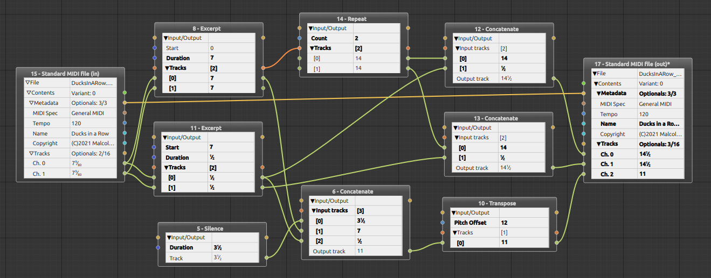

# BabelWires

BabelWires is a framework for building data format conversion applications.
It attempts to occupy a space between command-line utilities (which tend to be quite fixed in functionality), and code (which is highly flexible, but unavailable to many people).

Applications built in BabelWires allow a user to configure a conversion from a file in a source format to a file in a target format using a [dataflow](https://en.wikipedia.org/wiki/Dataflow_programming) style:
* Imported data is represented as a node with output ports
* Data to be exported is represented as a node with input ports
* Processors, which mutate the imported data, are represented as nodes with both input and output ports.

Users can create graphs of these nodes, defining how the source data is imported, processed and exported.    

BabelWires itself has no domain specific code, but provides the bulk of the domain agnostic code needed to construct this kind of application.
The defining use-case is [SeqWires](https://github.com/Malcohol/SeqWires), which supports the conversion of music sequence data between various music sequencer formats.

Here's a screenshot of SeqWires:



The framework provides:
* a generic way of representing data in a tree of self-describing data structures ([Feature](https://github.com/Malcohol/BabelWires/blob/main/BabelWiresLib/Features/features.hpp))
* abstractions for source and target formats ([SourceFileFormat](https://github.com/Malcohol/BabelWires/blob/main/BabelWiresLib/FileFormat/sourceFileFormat.hpp) and [TargetFileFormat](https://github.com/Malcohol/BabelWires/blob/main/BabelWiresLib/FileFormat/targetFileFormat.hpp))
* an abstraction for processing data ([Processor](https://github.com/Malcohol/BabelWires/blob/main/BabelWiresLib/Processors/processor.hpp))
* a data structure describing a graph of wired nodes ([Project](https://github.com/Malcohol/BabelWires/blob/main/BabelWiresLib/Project/project.hpp))
* a version-aware [serialization system](https://github.com/Malcohol/BabelWires/blob/main/Common/Serialization/serializable.hpp).
* a Qt-based application UI for manipulating projects. (Note: The underlying data management layer has no dependency on the UI or UI framework.)
* A generic way of defining maps between source and target values ([MapData](https://github.com/Malcohol/BabelWires/blob/main/BabelWiresLib/Maps/mapData.hpp)). 
* a first-class concept of failure, allowing the project to cope with structural changes to the imported data.

Here's a screenshot of the MapEditor defining a map between two types:


## Status

[](https://github.com/Malcohol/BabelWires/actions/workflows/ci.yml)

BabelWires is under active development, but please do not expect development to be rapid.
I have very limited time to devote to this.

## Downloading and Building

Clone recursively to ensure submodules are populated:

```
git clone --recurse-submodules https://github.com/Malcohol/BabelWires.git
```

BabelWires is intended to be cross platform.
I primarily work in a GNU/Linux environment, but I'll try to ensure the MSVC/Windows build works.
Building in other environments is untested.

## License

BabelWires is licensed under the GPLv3.
See the [LICENSE](LICENSE) file.

BabelWires uses a customized version of the [Nodeeditor](https://github.com/paceholder/nodeeditor) project for its GUI.
My fork with the customizations is [here](https://github.com/Malcohol/nodeeditor), and that libary (and my customizations) are licensed under the BSD 3-Clause License.

